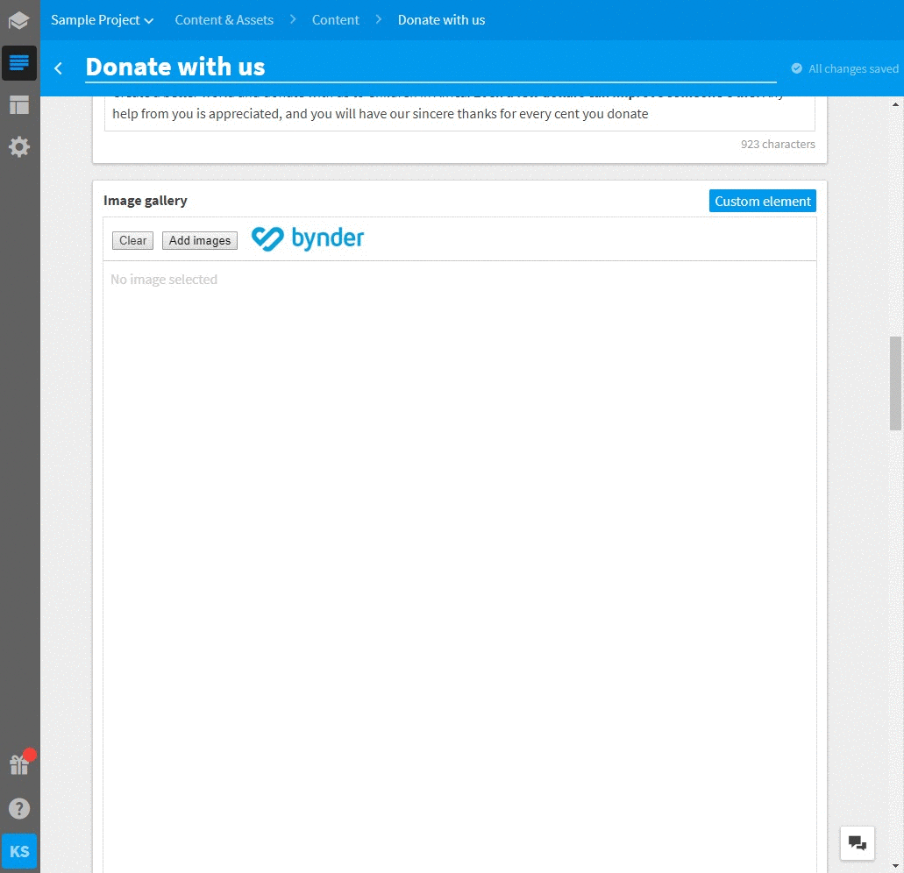

# Bynder image selector
Bynder image selector is a selector connected to Bynder instance which allows users to search and select images from Bynder assets. When the element is disabled, it only displays the selected images.



# Usage

If you want to use the Bynder image selector in your project in Kentico Kontent, follow these steps:

* In Kentico Kontent open Content types tab
* Open / create a content model to which you want to add the Bynder image selector
* Add **Custom element** content element
* Open configuration of the content element
* Use following URL as Hosted code URL (HTTPS): https://kentico.github.io/kontent-custom-element-samples/Bynder/image-selector.html
* Optionally provide the following JSON parameters for the custom element

```json
{
  "bynderUrl": "<YOUR BYNDER URL>",
  "previewDerivative": "webimage",
  "webDerivative": "webimage"
}
```

If you don't provide bynder URL, the selector will prompt for it while logging in.

The derivative parameters can be used to alter which of the [defined image derivatives](https://help.bynder.com/modules/asset-library/derivatives-knowhow.htm) will be used by the selector and output. By default the web image URL is used.

## Example output

The element will save a value containing the array of the selected images together with their metadata.

```json
[
  {
    "id": "AABE02D0-CD6D-4973-A5251B1C238A25CD",
    "previewUrl": "https://d2csxpduxe849s.cloudfront.net/media/final/e187906e-f579-4e10-800f-d01cb9ae5cda/webimage-5946F15F-3902-4F73-80EB4B83664960FB.png",
    "webUrl": "https://d2csxpduxe849s.cloudfront.net/media/final/e187906e-f579-4e10-800f-d01cb9ae5cda/webimage-5946F15F-3902-4F73-80EB4B83664960FB.png",
    "title": "which-brewing-fits-you-1080px"
  }
]
```

# Installation

Bynder image selector source code is in following repository: https://github.com/Kentico/cloud-custom-element-sample-bynder

If you want to adjust the implementation, first download [Kentico Kontent Custom Elements Devkit](https://github.com/kentico/custom-element-devkit). Source code of this selector needs be positioned within `/client/custom-elements` folder. For further instructions on devkit implementation, please refer to [Custom Element Devkit README](https://github.com/Kentico/custom-element-devkit/blob/master/readme.md).


