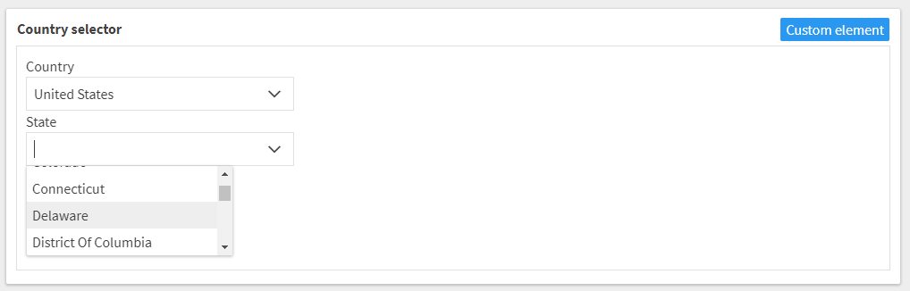

# Country and State selector
Country and state selector is a drop down selector which allows users to select country and state (if country has any). When the element is disabled, the dropdown is set to the readonly mode.

# Usage

If you want to use the country and state selector in your project in Kentico Cloud, follow these steps:

* In Kentico Cloud open Content types tab
* Open / create a content model to which you want to add the country and state selector
* Add **Custom element** content element
* Open configuration of the content element
* Use following URL as Hosted code URL (HTTPS): https://kentico.github.io/custom-element-samples/CountryStateSelector/country-state-selector.html

# Installation

Country and state selector source code is in following repository: https://github.com/ondrabus/kc-country-selector

If you want to adjust the implementation, first download [Kentico Cloud Custom Elements Devkit](https://github.com/kentico/custom-element-devkit). Source code of this selector needs be positioned within `/client/custom-elements` folder. For further instructions on devkit implementation, please refer to [Custom Element Devkit README](https://github.com/Kentico/custom-element-devkit/blob/master/readme.md).

