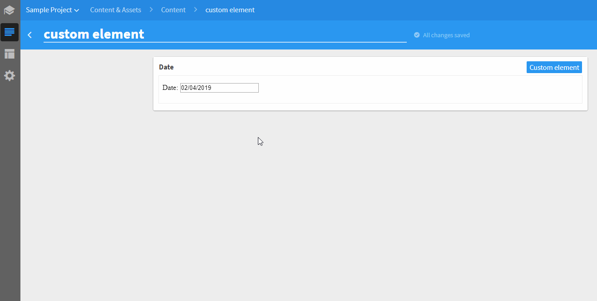

# Date picker

This is a simple calendar control based on [jQuery UI DatePicker](https://jqueryui.com/datepicker/) which lets you pick a date.



## Usage

If you want to use the Date picker in your Kentico Kontent project, follow these steps:

* In Kentico Kontent open Content types tab
* Open / create a content model to which you want to add the Date picker element
* Add **Custom element** content element
* Open configuration of the content element
* Use following URL as Hosted code URL (HTTPS): https://kentico.github.io/custom-element-samples/DatePicker/index.html
* You can specify different parameter {JSON} to set the [date format](http://api.jqueryui.com/datepicker/#option-dateFormat), like this:

```json
{
    "dateFormat": "dd/mm/yy"
}
```


