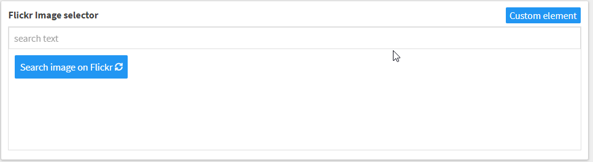

# Flickr image picker
The Flickr image picker allows to search images on Flickr and use them in your website.



# Usage

If you want to use the Flickr image picker in your project in Kentico Cloud, follow these steps:

* In Kentico Cloud open the Content types tab
* Create or edit a content model to which you want to add the Flickr image picker
* Add the **Custom element** content element
* Configure the content element
* Use the following URL as Hosted code URL (HTTPS): https://kentico.github.io/custom-element-samples/FlickrImagePicker/flickrimage-input-component.html
* Create API key for Flickr: https://www.flickr.com/services/developer/api/
* Provide JSON parameters for the custom element to configure the API Key:

```json
{
    "apikey": "[YOUR API KEY]"
}
```
* You can add more parameters, see here for all options: https://www.flickr.com/services/api/flickr.photos.search.html
The following options are supported: user_id, min_upload_date, max_upload_date, min_taken_date, max_taken_date, sort, privacy_filter, safe_search, content_type, geo_context. 
* NOTE : Use parameter "per_page" for how many images you want to see, by default this are 25. There is no pager added so "page" is absolute

## Example output

The element will save a value containing the URL of the image to Kentico cloud like //Image URL format https://farm{farm-id}.staticflickr.com/{server-id}/{id}_{secret}.jpg

```
{ 
	"photos": { 
		...
		"page": 1, 
		"pages": "1396186", 
		"perpage": 1, 
		"total": "1396186", 
		"photo": [{ 
			...
			"id": "46707213175", 
			"owner": "57712732@N04", 
			"secret": "3d79fd0112", 
			"server": "65535", 
			"farm": 66, "title": "Holland - Moerdijk bridges (2007)", 
			"ispublic": 1, 
			"isfriend": 0, 
			"isfamily": 0 
		}]
		...
	}, "stat": "ok" 
	...
}
```


