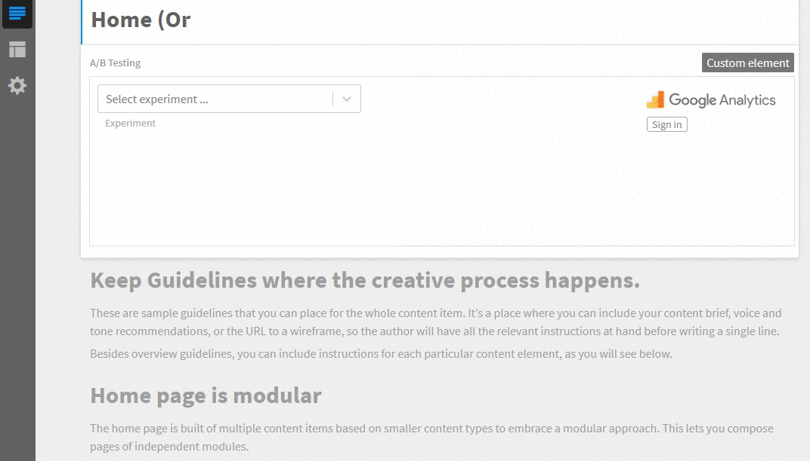

# Google Analytics Experiments selector
Google Analytics Experiments selector is a selector connected to Google Analytics instance which allows users to select an experiment and its variant.



# Usage

If you want to use the Google Analytics Experiment selector in your project in Kentico Kontent, follow these steps:

* In Kentico Kontent open Content types tab
* Open / create a content model to which you want to add the Google Analytics Experiment selector
* Add **Custom element** content element
* Open configuration of the content element
* Use following URL as Hosted code URL (HTTPS): https://kentico.github.io/kontent-custom-element-samples/GoogleAnalyticsExperiments/experiment-selector.html
* Provide the following JSON parameters for the custom element

```
{
  "clientId": "<YOUR GOOGLE APP CLIENT ID>.apps.googleusercontent.com",
  "accountId": "<YOUR GOOGLE ANALYTICS ACCOUNT ID>",
  "webPropertyId": "<YOUR GOOGLE ANALYTICS PROPERTY ID>",
  "profileId": "<YOUR GOOGLE ANALYTICS PROFILE ID>"
}
```

## Example output

The element will save a value containing the experiment/variant identifier as well as metadata need for first display of the selector.

```json
[
  "YI5uxeAkRZ-0E1-7oQ5FXg/2",
  {
    "experiment": {
      "id": "YI5uxeAkRZ-0E1-7oQ5FXg",
      "key": "190562962-3",
      "name": "Home page A/B test"
    },
    "variant": {
      "id": "2",
      "name": "Try Premium"
    }
  }
]
```

The experiment/variant identifier is at the beginning of the value so that the content items can be filtered based on the prefix of the value.

# Installation

Google Analytics Experiment selector source code is in following repository: https://github.com/Kentico/cloud-custom-element-sample-ga-experiments

If you want to adjust the implementation, first download [Kentico Kontent Custom Elements Devkit](https://github.com/kentico/custom-element-devkit). Source code of this selector needs be positioned within `/client/custom-elements` folder. For further instructions on devkit implementation, please refer to [Custom Element Devkit README](https://github.com/Kentico/custom-element-devkit/blob/master/readme.md).


