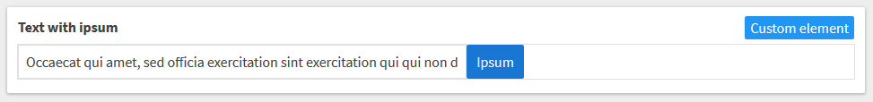

# Ipsum input
The ipsum input allows you to quickly add ipsum content to your input fields.



# Usage

If you want to use the ipsum input in your project in Kentico Kontent, follow these steps:

* In Kentico Kontent open the Content types tab
* Create or edit a content model to which you want to add the ipsum input
* Add the **Custom element** content element
* Configure the content element
* Use the following URL as Hosted code URL (HTTPS): https://kentico.github.io/custom-element-samples/IpsumInput/ipsum-input-component.html
* Optional: Provide the following JSON parameters for the custom element to configure the number of words to be generated

```json
{
    "words": 5
}
```


