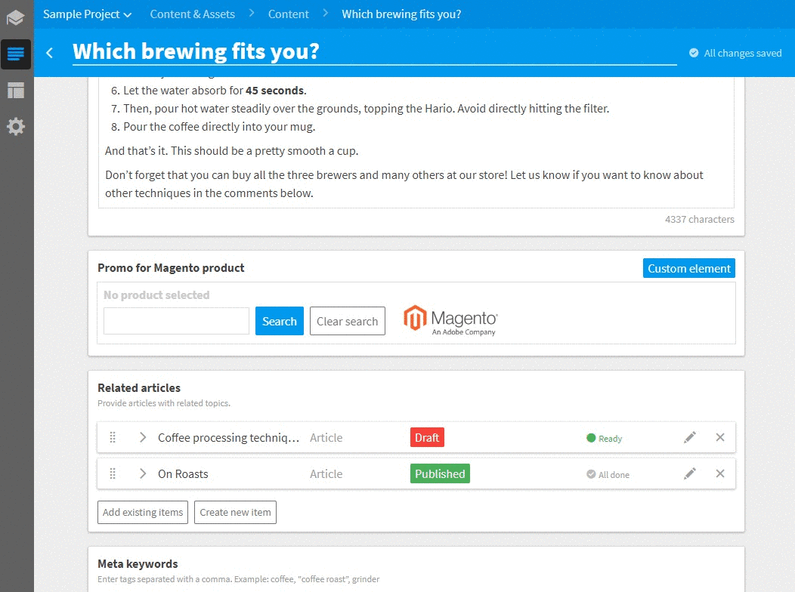

# Magento product selector
Magento product selector is a selector connected to Magento instance which allows users to search and select a product from Magento product catalog. When the element is disabled, it only displays the selected product.



# Usage

If you want to use the Magento product selector in your project in Kentico Cloud, follow these steps:

* In Kentico Cloud open Content types tab
* Open / create a content model to which you want to add the Magento product selector
* Add **Custom element** content element
* Open configuration of the content element
* Use following URL as Hosted code URL (HTTPS): https://kentico.github.io/custom-element-samples/Magento/product-selector.html
* Provide the following JSON parameters for the custom element to connect it to your store, replace the macros with the actual values for your setup

```
{
  "endpointUrl": "<PRODUCTS ENDPOINT URL>",
  "mediaRootUrl": "https://<YOUR MAGENTO DOMAIN>/pub/media/catalog/product",
  "urlKeyAttribute": "url_key"
}
```

Note that **urlKeyAtttribute** is optional, if not provided, it will be automatically generated with the value shown above.

# Installation

Magento product selector source code is in following repository: https://github.com/kenticomartinh/kc-magento

If you want to adjust the implementation, first download [Kentico Cloud Custom Elements Devkit](https://github.com/kentico/custom-element-devkit). Source code of this selector needs be positioned within `/client/custom-elements` folder. For further instructions on devkit implementation, please refer to [Custom Element Devkit README](https://github.com/Kentico/custom-element-devkit/blob/master/readme.md).


